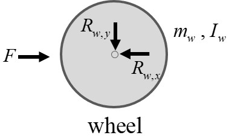
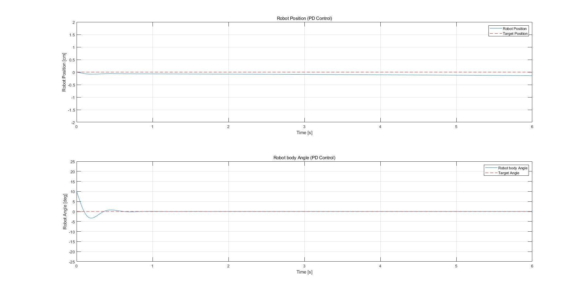
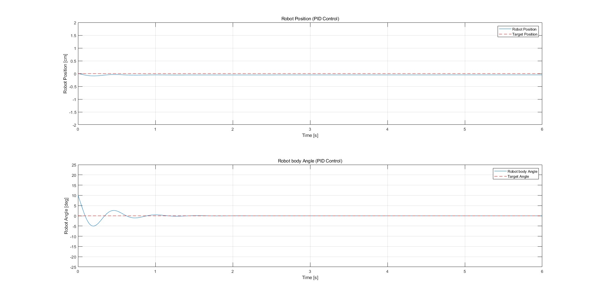

## Two wheel robot

The dynamics of a Two wheel robot are not much different from an inverted pendulum, and its mechanism is based on an inverted pendulum.
To analize Two wheel robot system, we follow the same process as for an inverted pendulum

**Relationship between x and $x_m$**

- $x_b = x - \frac{L}{b} \sin \theta$

- $y_b = \frac{L}{b} \cos \theta$

**Newton's second law for robot bodies**

- $ \left( m_w + m_b + \frac{I_w}{r^2} \right) \ddot{x} = m_j l \sin \theta \cdot \dot{\theta}^2 - m_j l \cos \theta \cdot \ddot{\theta} + \frac{\tau}{r} + f_w $
  
- $\sum F_{y, b} = R_y = m_b \left( g - l_b \cos \theta \cdot \dot{\theta}^2 - l_b \sin \theta \cdot \ddot{\theta} \right)$

**Torque equation for the center of mass of the robot body**

- $\sum \tau = R_x l_b \cos \theta + R_y l_b \sin \theta = I_b \ddot{\theta}$

If we linearize the above equation, we get the following equation:

- $I \ddot{\theta} = l_b m_b \ddot{x}_w + l_b m_b g \cdot \theta - l_b^2 m_b \cdot \ddot{\theta}$

At this time, $x$ is an arc of a circle, so it has the relationship $x = r \alpha$.

- $(I_b + m_b l_b^2) \cdot \ddot{\theta} = rl_b m_b \ddot{\alpha} + l_b m_b g \cdot \theta$

**Newton's second law for wheel movement in x direction**

- $\sum F_x = m_w \ddot{x_w}_ + m_b \ddot{x_b} + f_{ext} = F$
  
  $\therefore f_{ext} = \text{external force}$

To convert the above equation into an equation for the torque acting on the wheel, multiply both sides by $r$.

- $\tau_w = (m_w + m_b) r \ddot{x_w} + r l_b m_b \sin \theta \cdot \dot{\theta}^2 - r l_b m_b \cos \theta \cdot \ddot{\theta} + f_{ext}$

At this time, $x$ is an arc of a circle, so it has the relationship $x = r \alpha$.

- $\tau_w = (m_w + m_b) r^2 \ddot{\alpha} + r m_b l_b \sin \theta \cdot \dot{\theta}^2 - r m_b l_b \cos \theta \cdot \ddot{\theta} + f_{ext}$
  
If we linearize the above equation, we get the following equation:

- $\tau_w = (m_w + m_b) r^2 \ddot{\alpha} - r m_b l_b \ddot{\theta} + f_{ext}$

**All torque u acting on the wheel $u_\alpha$**

- $u_\alpha = \left[ (m_w + m_b) r^2 + I_w \right] \ddot{\alpha} - r m_b l_b \ddot{\theta} + C_\alpha \dot{\alpha}$

  $\therefore f_{ext} = \mu \cdot \omega = C_\alpha \dot{\alpha}$

**Figure 9:** Two wheel robot PD 

**Figure 10:** Two wheel robot PID 
 

