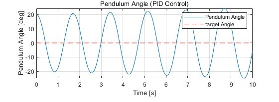
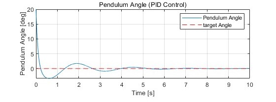
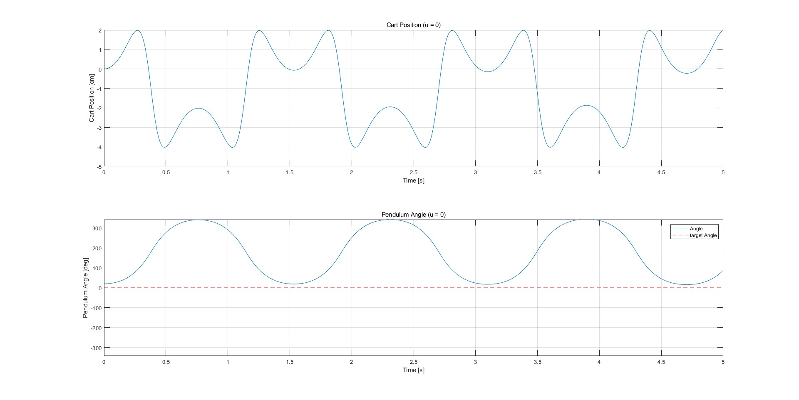
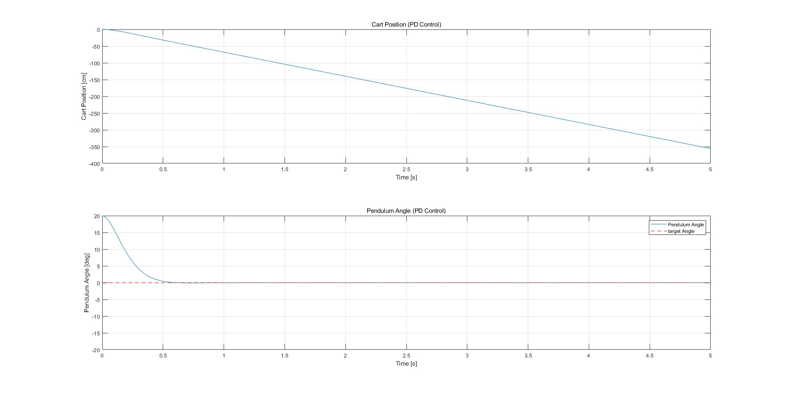
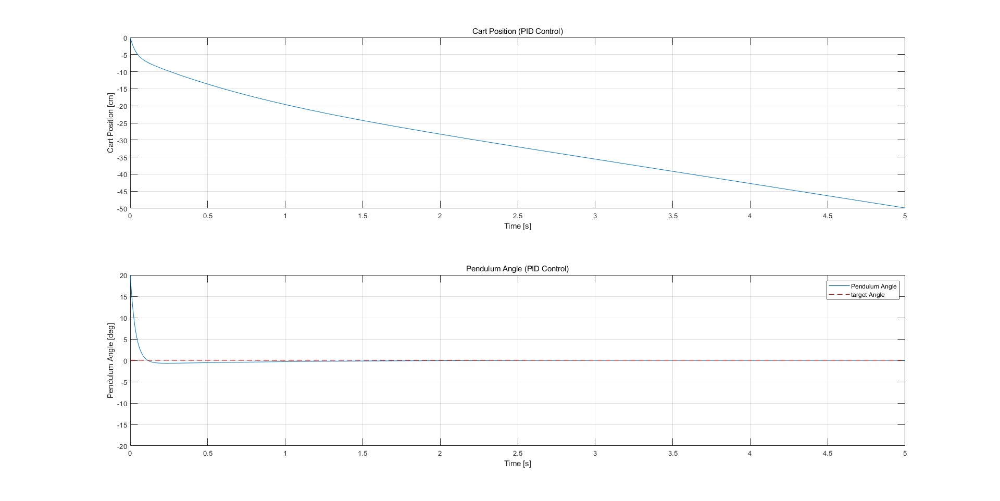

***
## Direct by Ruherpan
 
## Intro

A Two wheel robot maintains stability by moving its wheels. The advantage of a Two wheel robot is its ability to perform a pivot turn, allowing it to turn with a zero turning radius. However, before analyzing Two wheel robot, we must first understand how to control an inverted pendulum system, which is inherently unstable, to achieve stability. The inverted
pendulum system is a classic example of an unstable system. It consists of a pendulum with its center of gravity above its central point, This means that without a balancing force, the system easily falls over. To achieve stability, control inputs must continuously adjust the system position to prevent the pendulum from falling due to gravity. This requires precise and responsive control mechanisms. After analyzing the inverted pendulum system, we can then analyze the Two wheel robot. By examining the Two wheel robot system, we can derive the equations for control inputs necessary to achieve stability. Once we define the control inputs for the Two wheel robot, we can use the Control Moment Gyro (CMG) to control the robot.

## Inverted pendulum with cart System modelling

**Figure 1:** Model of inverted pendulum on cart

### Inverted pendulum on cart Parameters

|Symbol|Description|Value|
|:---|:---|:---|
|g|Gravity (m/s^2)|9.81|
|M|Mass of the cart (kg)|2|
|m|Mass of the pendulum (kg)|0.5|
|L|Length of pendulum (m)|0.3|
|r|Radius of the pendulum (m)|0.05|
|I|Moment of inertia|$I = \frac{(mr^2)}{2}$|

**Table 1: Inverted pendulum on cart Parameters**

Analyzing the system by dividing it into stick and cart

**Newtons’ second law for the center of mass of a stick**

- $\sum F_{x,m}:  R_x = m \ddot{x}_m$ 

- $\sum F_{y,m}:  R_y - mg = m \ddot{y}_m$

**Newton's second law for cart movement in x direction**

- $\sum F_x:  M \ddot{x} + R_x = F$

**Torque equation for the center of mass of the stick**

- $\sum \tau: R_x \frac{L}{2} \cos\theta + R_y \frac{L}{2} \sin\theta = I \ddot{\theta}$

**Relationship between x and $x_m$**

- $x_m = x - \frac{L}{2} \sin \theta$

- $y_m = \frac{L}{2} \cos \theta$

The equation of motion that defines the dynamics of the 'Inverted pendulum on cart' can be defined as: 

- $I \ddot{\theta} = \frac{L}{2} m \ddot{x} \cos \theta + \frac{L}{2} mg \sin \theta - \left(\frac{L}{2}\right)^2 m \ddot{\theta}$

**Equation 1**

- $F = (M + m) \ddot{x} + \frac{L}{2} m \sin \theta \cdot \dot{\theta}^2 - \frac{L}{2} m \cos \theta \cdot \ddot{\theta}$

**Equation 2**

If we rearrange this equation in terms of $\ddot{x}$ and $\ddot{\theta}$ :

- $\ddot{x} = \frac{1}{(M + m)} \left[ F - \frac{L}{2} m \sin \theta \cdot \dot{\theta}^2 + \frac{L}{2} m \cos \theta \cdot \ddot{\theta} \right]$

- $\ddot{\theta} = \frac{1}{a} \left( \frac{L}{2} m \ddot{x} \cos \theta + \frac{L}{2} mg \sin \theta \right) \qquad \qquad  \therefore a = I + \left( \frac{L}{2} \right)^2 m$

$\ddot{x}$ and $\ddot{\theta}$ can be defined as:

- $\ddot{x} = \frac{1}{b} \left[ Fa - a \frac{L}{2} m \sin \theta \cdot \dot{\theta}^2 + \left( \frac{L }{2} m \right)^2 g \sin \theta \cos \theta \right] \qquad \qquad \therefore b = a(M + m) - \left( \frac{L}{2} m \right)^2 \cos^2 \theta$

**Equation 3**

- $\ddot{\theta} = \frac{1}{b} \left[ F \frac{L}{2} m \cos \theta - \left( \frac{L}{2} m \right)^2 \ sin \theta \cos \theta \cdot \dot{\theta}^2 + (M + m) \frac{L}{2} mg \sin \theta \right] $

## PID Controller

### PID (Proportional Integral Derivative) Control

A PID controller is basically known as feedback controller. PID controller can control continuously changing objects. PID controller continuously calculates the error value $e(t)$. It can be defined as the difference between desired point $x_d$ and a measured variable $x$. ($e(t) = x_d - x$) 

The PID controller follows the equation below:

- $u(t) = K_p e(t) + K_i \int_{0}^{t} e(\tau) d\tau + K_d \frac{de(t )}{dt}$ 

**Equation 10**

**Figure 2:** PID 

As you can see in Figure 3, the PID system automatically apply accurate and responsive correction to a control funtion. To control a object using PID, u is the control input for controlling the object. For example, if you want to control the andgle, denoted as $\theta$, of an inverted pendulum, the error value $e(t)$ would be $e(t) = \theta_d - \theta$. By using the error value in **Equation 10**, you can get the control input u

### PID Tuning

|Control Type|$K_p$|$T_i$|$T_d$|
|:---:|:---:|:---:|:---:|
|P|$0.5K_u$|$\infty$|0|
|PI|$0.45K_u$|$\frac{1}{1.2} T_u$|0|
|PID|$0.6K_u$|$0.5T_u$|$0.125T_u$|

**Table 2:  Ziegler Nichols method**

We will use Ziegler Nichols method for PID tuning. The Ziegler Nichols method is a technique for obtaining gain value using an experimental optimization approach. I will show you how to perform PID tuning using the 'Inverted Pendulum on Cart' as described in **Equation 4**

1. Set ${K_i} , {K_d} = 0$, and find the value of constant amplitude through $K_p$ value. The cycle is $T_u = 1.7$ and $K_p = K_u = 30$ 

**Figure 3:** constant amplitude graph through ${K_p}$

2. If we organize **Equation 10** we can get $K_i = \frac{K_p}{T_i}, K_d = K_p T_d$ and this can be defined as: 

- $K_i = 1.2 \frac{K_u}{T_u}, K_d = 0.075 K_u T_u$

3. If we calculate the above equation, we can get $K_i$ and $K_d$

- $K_p = 30, K_i = 21, K_d = 3.825$

**Figure 4:** Inverted Pendulum on Cart PID control

## Inverted Pendulum on Cart Simulation

 

**Figure 5:** Inverted Pendulum on Cart u0

**Figure 6:** Inverted Pendulum on Cart PD

 

**Figure 7:** Inverted Pendulum on Cart PID

