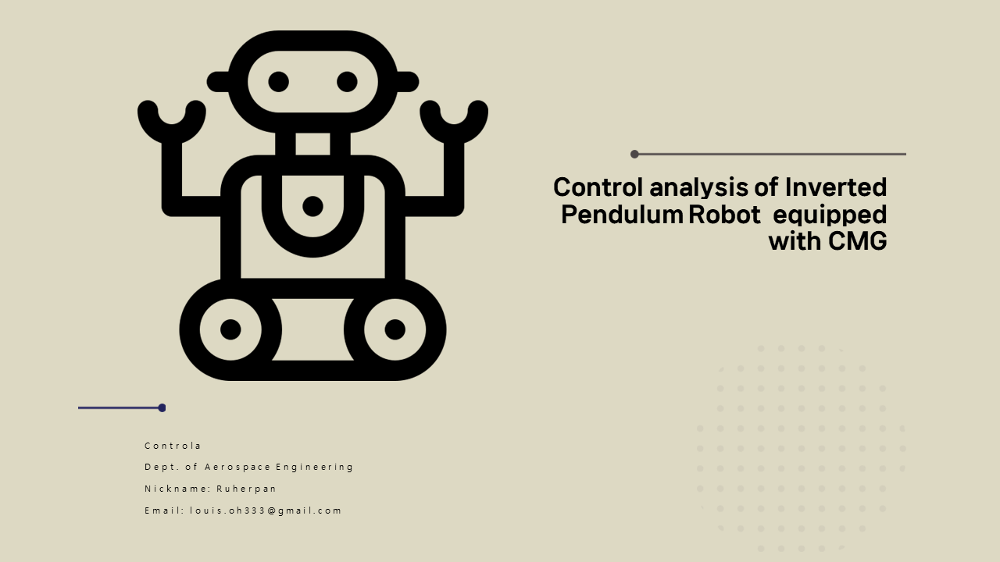
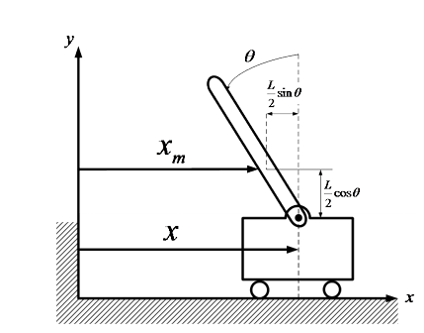
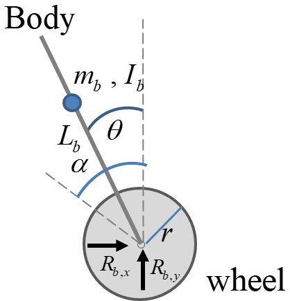

***
## Direct by Ruherpan

## Intro

A Two wheel robot maintains stability by moving its wheels. The advantage of a Two wheel robot is its ability to perform a pivot turn, allowing it to turn with a zero turning radius. However, before analyzing Two wheel robot, we must first understand how to control an inverted pendulum system, which is inherently unstable, to achieve stability. The inverted
pendulum system is a classic example of an unstable system. It consists of a pendulum with its center of gravity above its central point, This means that without a balancing force, the system easily falls over. To achieve stability, control inputs must continuously adjust the system position to prevent the pendulum from falling due to gravity. This requires precise and responsive control mechanisms. After analyzing the inverted pendulum system, we can then analyze the Two wheel robot. By examining the Two wheel robot system, we can derive the equations for control inputs necessary to achieve stability. Once we define the control inputs for the Two wheel robot, we can use the Control Moment Gyro (CMG) to control the robot.

## Inverted pendulum with cart System modelling

**Figure 1:** Inverted pendulum on cart

### Inverted pendulum on cart Parameters

|Symbol|Description|Value|
|:---|:---|:---|
|g|Gravity (m/s^2)|9.81|
|M|Mass of the cart (kg)|2|
|m|Mass of the pendulum (kg)|0.5|
|L|Length of pendulum (m)|0.3|
|r|Radius of the pendulum (m)|0.05|
|I|Moment of inertia|$I = \frac{(mr^2)}{2}$|

Analyzing the system by dividing it into stick and cart

**Newtons’ second law for the center of mass of a stick**

$\sum F_{x,m} = R_x = m \ddot{x}_m$

$\sum F_{y,m} = R_y - mg = m \ddot{y}_m$

**Torque equation for the center of mass of the stick**

$\sum \tau = R_x \frac{L}{2} \cos\theta + R_y \frac{L}{2} \sin\theta = I \ddot{\theta}$

**Newtons’ second law for cart movement in x direction**

$\sum F_x = M \ddot{x} + m \ddot{x}_m = F$

**Relationship between x and $x_m$**

$x_m = x - \frac{L}{2} \sin \theta$

$y_m = \frac{L}{2} \cos \theta$

The equation of motion that defines the dynamics of the "Inverted pendulum on cart" can be defined as follows: 

$I \ddot{\theta} = \frac{L}{2} m \ddot{x} \cos \theta + \frac{L}{2} mg \sin \theta - \left(\frac{L}{2}\right)^2 m \ddot{\theta}$

**Equation 1**

$F = (M + m) \ddot{x} + \frac{L}{2} m \sin \theta \cdot \dot{\theta}^2 - \frac{L}{2} m \cos \theta \cdot \ddot{\theta}$

**Equation 2**

Summarize this equation in terms of $\ddot{x}$ and $\ddot{\theta}$ :

$\ddot{x} = \frac{1}{(M + m)} \left[ F - \frac{L}{2} m \sin \theta \cdot \dot{\theta}^2 + \frac{L}{2} m \cos \theta \cdot \ddot{\theta} \right]$

**Equation 3**

$a = I + \left( \frac{L}{2} \right)^2 m$

$\ddot{\theta} = \frac{1}{a} \left( \frac{L}{2} m \ddot{x} \cos \theta + \frac{L}{2} mg \sin \theta \right)$

**Equation 4**

## Two wheel robot system modelling System modelling

**Figure 2:** Two wheel robot

### Two wheel robot Parameters

|Symbol|Description|Value|
|:---|:---|:---|
|g|Gravity (m/s^2)|9.81|
|M|Mass of the cart (kg)|2|
|m|Mass of the pendulum (kg)|0.5|
|L|Length of pendulum (m)|0.3|
|$r_w$|Radius of the wheel (m)|0.03|
|$r_b$|Radius of the robot body (m)|0.03|
|$I_b$|Moment of inertia of the robot body|$I = \frac{(m(r_b)^2)}{2}$|
|$C_{\alpha}$|viscosity coefficient of the wheel|0.00055|

Using the same method we use to analyze the Inverted pendulum on a cart, we can derive the equation of a Two wheel robot. The equation of motion that defines the dynamics of the "Two wheel robot" can be defined as follows($f_{\text{ext}}$ = external force):

$I \ddot{\theta} = l_b m_b \ddot{x}_w \cos \theta + l_b m_b g \sin \theta - l\ _b^2m_b \cdot \ddot{\theta}$

Since $x$ is the length of the arc, it has the relationship $x=ra$. we can get the following equation:

$I \ddot{\theta} = l_b m_b r \ddot{\alpha} \cos \theta + l_b m_b g \sin \theta - l_b ^2m_b \cdot \ddot{\theta}$

**Equation 5**

$F_w = (m_w + m_b) \ddot{x_w} + l_b m_b \sin \theta \cdot \dot{\theta}^2 - l_b m_b \cos \theta \cdot \ddot{\theta} +f_{\text{ext}}$

To convert the above equation into an equation for the torque acting on the wheel, both sides must be multiplied by $r$. Since $x$ is the length of the arc, it has the relationship $x=ra$. we can get the following equation:

$\tau_w = (m_w + m_b) r^2 \ddot{\alpha} + r m_b l_b \sin \theta \cdot \dot{\theta}^2 - r m_b l_b \cos \theta \cdot \ddot{\theta} + f_{\text{ext}}$

**Equation 6**

Linearizing equations 5 and 6 leads to the following equations:

$\left( I_b + m_b l_b^2 \right) \ddot{\theta} = r l_b m_b \ddot{\alpha} + l_b m_b g \cdot \theta$

**Equation 7**

$\tau_w = \left( m_w + m_b \right) r^2 \ddot{\alpha} - r m_b l_b \ddot{\theta} + f_{\text{ext}}$

**Equation 8**

If $f_{\text{ext}}$ is the viscous torque that occurs when the wheel rotates, we get the following equation by equation 8:

$u_{\alpha} = \left[ \left( m_w + m_b \right) r^2 + I_w \right] \ddot{\alpha} - r m_b l_b \ddot{\theta} + C_{\alpha} \dot{\alpha}$

**Equation 9**

## Two wheel robot with CMG system modelling

### Two wheel robot with CMG Parameters

## Control Design & Simulation

### PID (Proportional Integral Derivative) Control

A PID controller is basically known as feedback controller. PID controller can control continuously changing objects. PID controller continuously calculates an error value $e(t)$ wtich can be define as difference between desired point $(x_d)$ and a measured variable $(x)$

**Figure 3:** PID 

### PID Tuning

