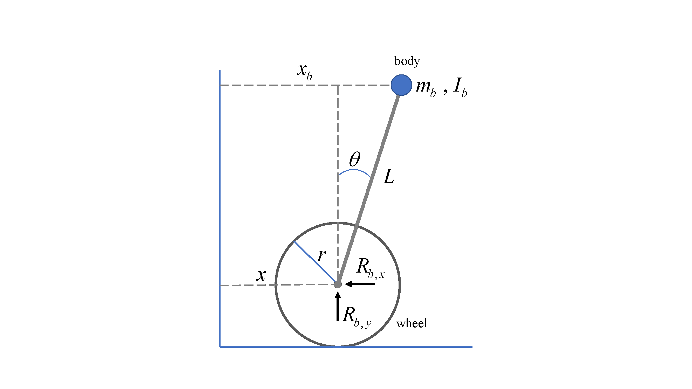
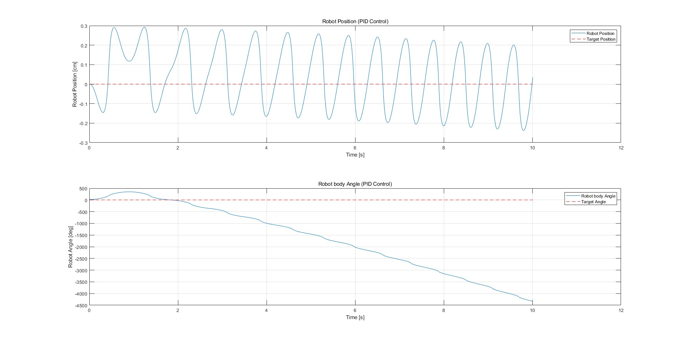
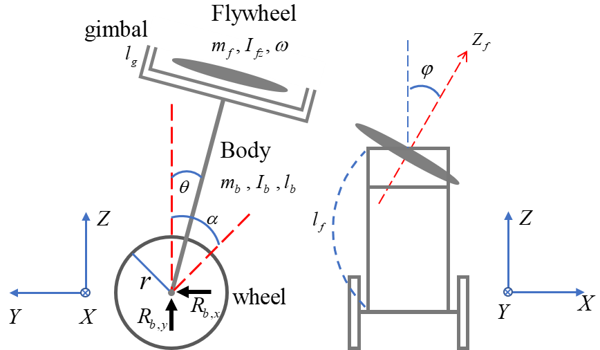

## Two wheel robot

The dynamics of a Two wheel robot are not much different from an inverted pendulum, and its mechanism is based on an inverted pendulum.
To analize Two wheel robot system, we follow the same process as for an inverted pendulum

**Figure 1:** Model of two wheel robot

|Symbol|Description|Value|
|:---|:---|:---|
|g|Gravity ($m/s^2$)|9.81|
|$m_b$|Robot mass ($kg$)|2|
|$m_w$|Wheel mass ($kg$)|0.5|
|r|Wheel radius ($m$)|0.03|
|L|Length of pendulum ($m$)|0.3|
|I|Moment of inertia ($kg  m^2$)|$I = \frac{(mr^2)}{2}$|
|$f_w$|external force acting on the wheel|0.003|

**Table 1: Two wheel robot Parameters**

**Relationship between x and $x_b$**

- $x_b = x + \frac{L}{2} \sin \theta$

- $y_b = \frac{L}{2} \cos \theta$

Since $x$ is the length of the arc, it has the relationship $x=ra$. we can get the following equation: 

$\therefore$ $H_w$ : Reaction force in the horizontal direction of the wheel

**Horizontal reaction force of the wheel**

- $I_w \ddot{\alpha} = \tau - H_w r $

**Translational movement of the wheel**

- $m_w \ddot{x} = f_w + R_x + H_w$

As we obtained from the inverted pendulum, we get the following equation:

- $R_x = f_b - m_b \ddot{x}_b$

- $R_y = m_b \ddot{y}_b + m_b g$
  
**Newton's second law for cart movement in x direction**

- $\left( m_w + m_b + \frac{I_w}{r^2} \right) \ddot{x} = m_b l \sin \theta \cdot \dot{\theta}^2 - m_b l \cos \theta \cdot \ddot{\theta} + \frac{\tau}{r} + f_w$

**Torque equation for the center of mass of the Robot**

- $I_b \ddot{\theta} = R_x l \cos \theta + R_y l \sin \theta - \tau$

if we slove this equation, we can get the equation of Torque for the center of mass of the Robot

- $\left(I_b + m_b l^2\right) \ddot{\theta} = m_b g l \sin \theta - m_b l \cos \theta \cdot \ddot{x} - \tau + f_b l \cos \theta$

**Linearize**

If we linearize the above equation and then organize it into equations for $\ddot{x}$ and $\ddot{\theta}$, we get the following equation :

$\therefore$ $W = \left( m_w + m_b + \frac{I_w}{r^2} \right)$ , $P = I_b + m_b l^2$ , $Q = m_b l$

- $\ddot{x} = \frac{1}{Z} Q^2 g \theta + \frac{1}{Z} \left( \frac{QP}{r} \right) \tau$

- $\ddot{\theta} = -\frac{1}{Z} WQg \theta + \frac{1}{Z} \left( \frac{Q}{r} + W \right) \tau$

**Equation of state**

- $\dot{\mathbf{x}} = \mathbf{A} \mathbf{x} + \mathbf{B} \mathbf{u}$

The state matrix is ​​as follows:

## Robot Simulation

**Figure 2:** Robot u0

## Two wheeled robot posture stability control using CMG

To analyze a Two wheeled robot posture stability control system using CMG, a Direction Cosine Matrix (DCM) must be defined. After difining DCM we analyze the CMG using the Euler-Lagrange equation. Analyzing the system using the Euler-Lagrange equations is less complex than analyzing it using Newton's laws. You only need to solve the equations for kinetic and potential energy.

**Figure 3:** Model of Two wheeled robot posture stability control using CMG

