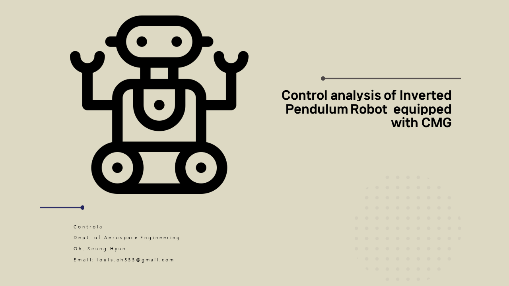

***
## Direct by Ruherpan

## Intro

A Two wheel robot maintains stability by moving its wheels. The advantage of a Two wheel robot is its ability to perform a pivot turn, allowing it to turn with a zero turning radius. However, before analyzing Two wheel robot, we must first understand how to control an inverted pendulum system, which is inherently unstable, to achieve stability. The inverted
pendulum system is a classic example of an unstable system. It consists of a pendulum with its center of gravity above its central point, This means that without a balancing force, the system easily falls over. To achieve stability, control inputs must continuously adjust the system position to prevent the pendulum from falling due to gravity. This requires precise and responsive control mechanisms. After analyzing the inverted pendulum system, we can then analyze the Two wheel robot. By examining the Two wheel robot system, we can derive the equations for control inputs necessary to achieve stability. Once we define the control inputs for the Two wheel robot, we can use the Control Moment Gyro (CMG) to control the robot.

## contents
"This project is to control a Two wheel robot using CMG (Control Moment Gyro). The project sequence is analysis, simulation without control input, Simulation with PID control. The project contents follows the picture below

