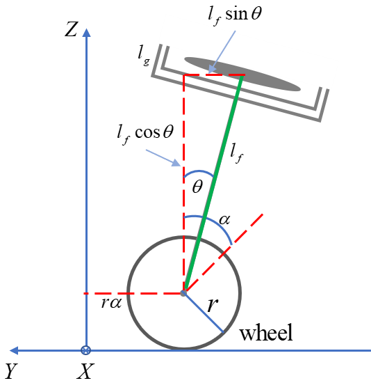

## Two wheel robot

The dynamics of a Two wheel robot are not much different from an inverted pendulum, and its mechanism is based on an inverted pendulum.
To analize Two wheel robot system, we follow the same process as for an inverted pendulum

**Figure 1:** Model of two wheel robot

|Symbol|Description|Value|
|:---|:---|:---|
|g|Gravity ($m/s^2$)|9.81|
|$m_b$|Robot mass ($kg$)|2|
|$m_w$|Wheel mass ($kg$)|0.5|
|r|Wheel radius ($m$)|0.03|
|L|Length of pendulum ($m$)|0.3|
|I|Moment of inertia ($kg  m^2$)|$I = \frac{(mr^2)}{2}$|
|$f_w$|external force acting on the wheel|0.003|

**Table 1: Two wheel robot Parameters**

**Relationship between x and $x_b$**

- $x_b = x + \frac{L}{2} \sin \theta$

- $y_b = \frac{L}{2} \cos \theta$

Since $x$ is the length of the arc, it has the relationship $x=ra$. we can get the following equation: 

$\therefore$ $H_w$ : Reaction force in the horizontal direction of the wheel

**Horizontal reaction force of the wheel**

- $I_w \ddot{\alpha} = \tau - H_w r $

**Translational movement of the wheel**

- $m_w \ddot{x} = f_w + R_x + H_w$

As we obtained from the inverted pendulum, we get the following equation:

- $R_x = f_b - m_b \ddot{x}_b$

- $R_y = m_b \ddot{y}_b + m_b g$
  
**Newton's second law for cart movement in x direction**

- $\left( m_w + m_b + \frac{I_w}{r^2} \right) \ddot{x} = m_b l \sin \theta \cdot \dot{\theta}^2 - m_b l \cos \theta \cdot \ddot{\theta} + \frac{\tau}{r} + f_w$

**Torque equation for the center of mass of the Robot**

- $I_b \ddot{\theta} = R_x l \cos \theta + R_y l \sin \theta - \tau$

if we slove this equation, we can get the equation of Torque for the center of mass of the Robot

- $\left(I_b + m_b l^2\right) \ddot{\theta} = m_b g l \sin \theta - m_b l \cos \theta \cdot \ddot{x} - \tau + f_b l \cos \theta$

**Linearize**

If we linearize the above equation and then organize it into equations for $\ddot{x}$ and $\ddot{\theta}$, we get the following equation :

$\therefore$ $W = \left( m_w + m_b + \frac{I_w}{r^2} \right)$ , $P = I_b + m_b l^2$ , $Q = m_b l$

- $\ddot{x} = \frac{1}{Z} Q^2 g \theta + \frac{1}{Z} \left( \frac{QP}{r} \right) \tau$

- $\ddot{\theta} = -\frac{1}{Z} WQg \theta + \frac{1}{Z} \left( \frac{Q}{r} + W \right) \tau$

**Equation of state**

- $\dot{\mathbf{x}} = \mathbf{A} \mathbf{x} + \mathbf{B} \mathbf{u}$

The state matrix is ​​as follows:

## Robot Simulation

**Figure 2:** Robot u0

## Two wheeled robot posture stability control using CMG

To analyze a Two wheeled robot posture stability control system using CMG, a Direction Cosine Matrix (DCM) must be defined. After difining DCM we analyze the CMG using the Euler-Lagrange equation. Analyzing the system using the Euler-Lagrange equations is less complex than analyzing it using Newton's laws. You only need to solve the equations for kinetic and potential energy.

**Figure 3:** Model of Two wheeled robot posture stability control using CMG

**Inertial coordinates and body coordinates**

**Relationship between wheel coordinates and inertial coordinates**

**Coordinate relationship of Robot & Wheel**

**Coordinate relationship of Robot & Wheel**

**flywheel coordinate**

**Euler Lagrange equation**

To find Euler-Lagrange equations, we need to find the Lagrangian. Lagrangian is obtained as:

- $L = K - U$

where K and U are:

- $K = K_f + K_g + K_b + K_w$

- $U = U_f + U_g + U_b + U_w$

Potential energy is easy to find, because potential energy formula is about high. potential energy formula is obtained as:

- $U_f = m_f g l_f \cos \theta$

- $U_g = m_g g \left(l_f - l_g \cos \varphi \right) \cos \theta$

- $U_b = m_b g l_b \cos \theta$

- $U_w = m_w g r$

Now let's find kinetic energy formula.

The kinetic energy of an object can be divided into two types of energy: rotational kinetic energy and kinetic energy. If we can find the two energies, we can get the kinetic energy of the object by adding the rotational kinetic energy to the kinetic energy.

For example, let's find the rotational kinetic energy of flywheel.

Flywheel coordinates have the same coordinates as gimbal coordinates. Angular velocity coordinate relationship between robot and gimbal

The angular velocity coordinate relationship between the robot and the gimbal is obtained as:

The gimbal angular velocity is obtained as:

The Flywheel Angular velocity is obtained as:

The rotational kinetic energy of a rigid body is $K_R = \frac{1}{2} I \left( \omega_x + \omega_y + \omega_z \right)^2$. However, in the flywheel, $\omega_y = 0$, so $K_R = \frac{1}{2} I \left( \omega_x + \omega_z \right)^2$.
To get the rotational kinetic energy, we need to add the above three matrices. (The flywheel is affected by the angular velocity of the gimbal in the x-axis direction.) Therefore, the flywheel rotational kinetic energy can be obtained as:

- $\frac{1}{2} I_{fx} \left( \cos^2 \varphi \cdot \dot{\theta}^2 + \dot{\varphi}^2 \right) + \frac{1}{2} I_{fz} \left( \sin \varphi \cdot \dot{\theta} + \omega \right)^2$

The Relationship between x and y

- $y = r \alpha + l_f \sin \theta$

- $z = l_f \cos \theta$

The kinetic energy of a rigid body is $\boldsymbol{T} = \frac{1}{2} m \boldsymbol{v}^2 = \frac{1}{2} m_f \left(v_x^2 + v_y^2 + v_z^2\right)$. However, as shown in Figure 3, $v_x = 0$, so $\boldsymbol{T} = \frac{1}{2} m_f \left(v_y^2 + v_z^2\right)$. Therefore, the kinetic energy can be obtained as:

- $\boldsymbol{T} = \frac{1}{2} m_f \left[ \left(r \dot{\alpha}\right)^2 + 2r \dot{\alpha} l_f \cos \theta \cdot \dot{\theta} + \left(l_f \cos \theta \cdot \dot{\theta}\right)^2 + \left(l_f \sin \theta \cdot \dot{\theta}\right)^2 \right]$

The total flywheel kinetic energy is: 

- $K_f = \frac{1}{2} I_{fx} \left( \cos^2 \varphi \cdot \dot{\theta}^2 + \dot{\varphi}^2 \right) + \frac{1}{2} I_{fz} \left( \sin \varphi \cdot \dot{\theta} + \omega \right)^2 + \frac{1}{2} m_f l_f^2 \dot{\theta} + m_f \dot{\alpha} r l_f \cos \theta \cdot \dot{\theta} + \frac{1}{2} m_f \left( r \dot{\alpha} \right)^2$

The remaining kinetic energy can be found in the same way as the flywheel kinetic energy.

The total gimbal kinetic energy is: 

- $K_g = \frac{1}{2} I_{gx} \left( \cos^2 \varphi \cdot \dot{\theta}^2 \right) + \frac{1}{2} I_{gy} \left( \dot{\varphi} \right)^2 + \frac{1}{2} I_{gz} \left( \sin \varphi \cdot \dot{\theta} \right)^2 + \frac{1}{2} m_g l_g^2 \dot{\varphi}^2 + \frac{1}{2} m_g \left(l_f - l_g \cos \varphi \right)^2 \dot{\theta}^2 + \frac{1}{2} m_g \left( r \dot{\alpha} \right)^2$

The total robot kinetic energy is: 

- $K_b = \frac{1}{2} I_{bx} \dot{\theta}^2 + \frac{1}{2} m_b \left( r \dot{\alpha} \right)^2 + m_b r \dot{\alpha} l_b \cos \theta \cdot \dot{\theta} + \frac{1}{2} m_b \left( l_b \dot{\theta} \right)^2$

The total wheel kinetic energy is: 

- $K_w = \frac{1}{2} I_w \dot{\alpha}^2 + \frac{1}{2} m_w \left( r \dot{\alpha} \right)^2$

**Total Kinetic energy and Potential energy**

- \[
K = K_f + K_g + K_b + K_w \\
= \frac{1}{2} I_{fx} \left( \cos^2 \varphi \cdot \dot{\theta}^2 + \dot{\varphi}^2 \right) + \frac{1}{2} I_{fz} \left( \sin \varphi \cdot \dot{\theta} + \omega \right)^2 + \frac{1}{2} m_f l_f^2 \dot{\theta}^2 + m_f \dot{\alpha} r l_f \cos \theta \cdot \dot{\theta} + \frac{1}{2} m_f \left( r \dot{\alpha} \right)^2 \\
+ \frac{1}{2} I_{gx} \left( \cos^2 \varphi \cdot \dot{\theta}^2 \right) + \frac{1}{2} I_{gy} \left( \dot{\varphi} \right)^2 + \frac{1}{2} I_{gz} \left( \sin \varphi \cdot \dot{\theta} \right)^2 + \frac{1}{2} m_g l_g^2 \dot{\varphi}^2 \\
+ \frac{1}{2} m_g \left(l_f - l_g \cos \varphi \right)^2 \dot{\theta}^2 + \frac{1}{2} m_g \left( r \dot{\alpha} \right)^2 \\
+ \frac{1}{2} I_{bx} \dot{\theta}^2 + \frac{1}{2} m_b \left( r \dot{\alpha} \right)^2 + m_b r \dot{\alpha} l_b \cos \theta \cdot \dot{\theta} + \frac{1}{2} m_b \left( l_b \dot{\theta} \right)^2 \\
+ \frac{1}{2} I_w \dot{\alpha}^2 + \frac{1}{2} m_w \left( r \dot{\alpha} \right)^2
\]

