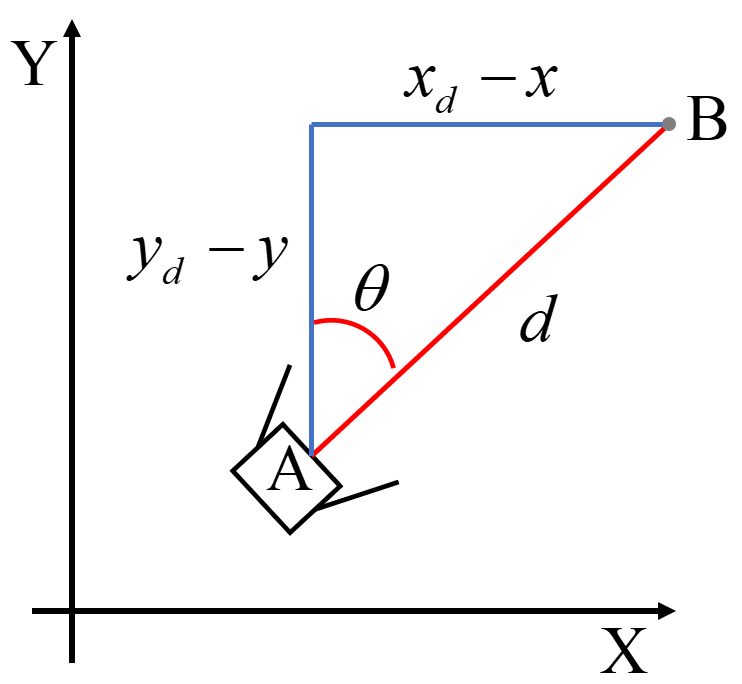

## Intro

Trajectory tracking allows the system to follow a preset path over time. Using this method, the results of movement can be predicted through simulation without physical experimentation.
Trajectory tracking involves path planning and orbit generation. Path planning is about finding the optimal path to reach a goal from an initial state, given information about the robot and its surroundings. Trajectory generation specifically defines position, velocity, and acceleration functions over time to follow the planned path after path planning is complete.
There are several ways to track trajectories, but for this page we will use PID and FLC.

## Trajectory tracking

To track trajectories we need two states, Heading angle and speed. 

If you know the two states mentioned above, tracking the trajectory is simple. For example, if you are at point A and plan to travel to point B in 30 minutes, what information do you need? Those are direction and speed. Using these two information, you can predict where your next location will be every time you move. Let's apply this method to a robot. If you want to know the path the robot moves. We need the error between target position and current position. This is because the error between target position and current position contains two information: heading angle and speed.

**Figure 1:** Trajectory tracking

**Figure 2:** Trajectory tracking using PID
